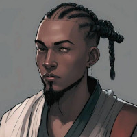

# Il Richiamo delle Onde
Appunti della campagna "Il richiamo delle onde" masterata da Gabbo per il gioco di ruolo Dungeons & Dragons 5a edizione.

I Personaggi Giocanti (PG) di questa campagna sono: 

|Felix Astorio                                   |Puppis                                            |Stone                                           |Victor Vega                                                 |
|:----------------------------------------------:|:------------------------------------------------:|:----------------------------------------------:|:----------------------------------------------------------:|
|||||
|Umano monaco                                    |Tabaxi Ladro                                      |Tortuga Stregone                                 |Genasi dell'acqua Bardo                                    |

|Sam Lassen                                      |Stein Hein                                        |
|:----------------------------------------------:|:------------------------------------------------:|
|       |     |
|Mezz'orco barbaro                               |Genasi dell'acqua artefice                        |
